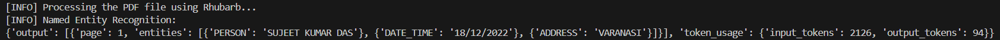
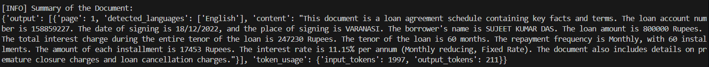
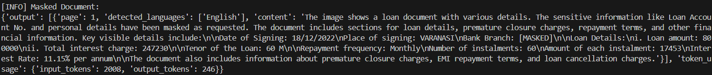

# Scanned PDF Extraction App

## Overview

This app processes scanned PDF files to extract structured information using the **Rhubarb framework** integrated with **AWS Bedrock**. It simplifies handling unstructured documents like loan agreements, contracts, or invoices by combining OCR, entity recognition, summarization, and masking into a single workflow.

## Workflow

1. **Input**: User provides the path to a scanned PDF file.
2. **Processing**:
   - The app converts the PDF into images for each page.
   - OCR is applied to extract text from the images.
3. **Entity Extraction**: Rhubarb identifies key details like:
   - Borrower and co-borrower names
   - Loan account numbers
   - Dates (e.g., signing date)
   - Addresses (e.g., place of signing)
4. **Summarization**: A concise summary of the document is generated, focusing on important details such as loan terms and borrower information.
5. **Masking**: Sensitive data (e.g., loan account numbers) is replaced with placeholders for privacy.
6. **Output**: The results include:
   - Extracted entities in a structured format
   - A summary of the document
   - Masked sensitive text

## Features

| Feature                     | Description                                                                                             |
|-----------------------------|---------------------------------------------------------------------------------------------------------|
| **OCR Integration**         | Extracts text from scanned PDFs to enable further processing.                                           |
| **Named Entity Extraction** | Identifies critical details like names, dates, addresses, and loan-related numbers using Bedrock LLMs. |
| **Summarization**           | Provides a concise summary of the document content.                                                    |
| **Data Masking**            | Hides sensitive information like account numbers to ensure privacy.                                    |

Here’s an example of the structured entity extraction output:

The image showcases how Rhubarb extracts details like names, dates, and other important entities, generate summaries and mask PII from scanned PDFs.
